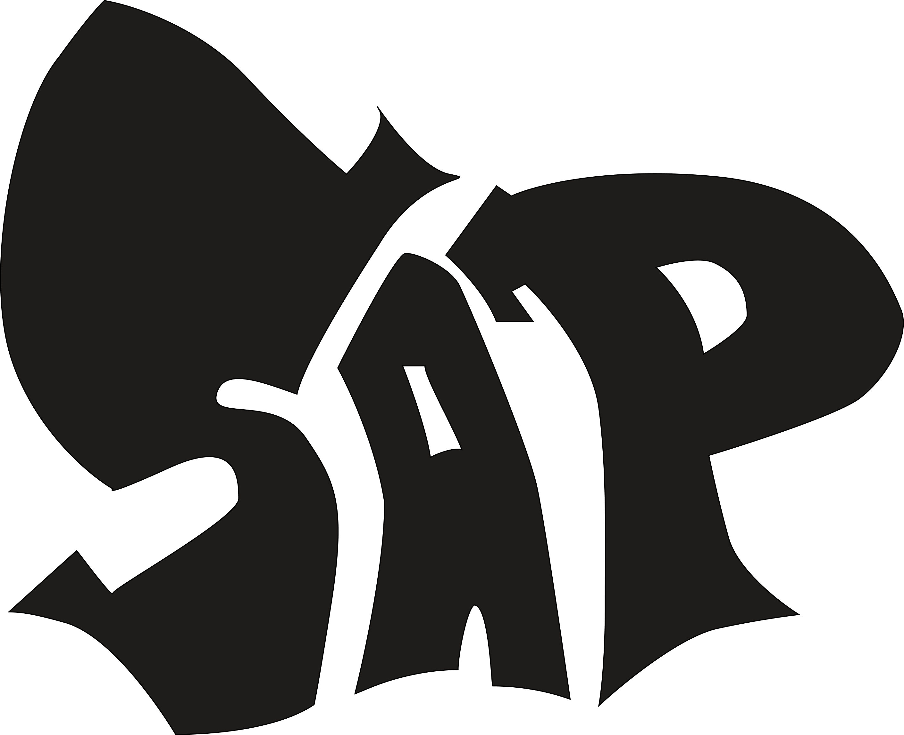

## About SAP

Shirts & Pants (SAP) is an E-commerce website created using Laravel and Vue.js. It is a simple E-commerce website where users can view products, add them to cart, and place an order. The website also has an admin panel where the admin can add, update, and delete products. The admin can also view the orders placed by the users.

## How to run the project

The project uses MySQL database. It is a requirement to create a database and update the `.env` file with the database credentials for the project to work properly.

-   Clone the repository
-   Run `composer install` to install the dependencies
-   Run `npm install` to install the dependencies
-   Run `npm run dev` to compile the assets
-   Run `php artisan serve` to start the server
